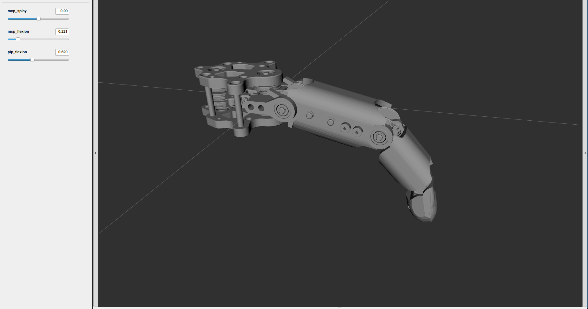

# finger_description package
* RDS Speedster team
* Spring 2026

## Description
This package provides a urdf and sdf description for the speedster team's robotic finger.

## Launchfiles
| Launch file | Description |
|---|---|
| `ros2 launch finger_description fingerviz.launch.xml` | URDF visualization in Rviz2 with interactive `joint_state_publisher_gui` for manual joint control. |

## Config files
| File | Description |
|---|---|
| `config/finger.yaml` | Finger kinematic parameters (motor radii, link lengths, screw axes, joint limits, home config). Loaded by most nodes across all packages. |

## Screenshot

